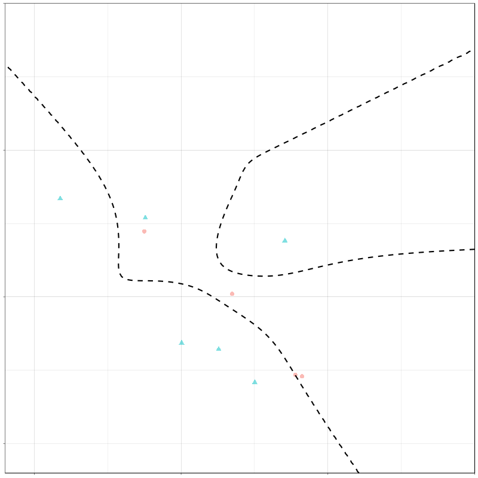

class: center, middle

# Let's get Started

---
# A Recommended Reference

.left[

**Strobl et al. (2009)**

* offer a great review of the material in this workshop
* has been cited >2,300 times (according to Google Scholar)
* technical, but directed towards applied researchers and practitioners

] 


---
class: center

# An Essential Consideration in Applied Computational Research 

.left[
* Software packages come with default settings

* Defaults are **rarely** the most robust method, the most flexible approach, etc. 

* In Machine Learning (ML) specifically, calibrating these settings is known as "hyper parameter tuning", "hyper parameter optimization", etc.

* People spend entire careers using conceptual mathematics and computer science to master this tuning/optimization

* Many non-ML pieces of programming have defaults, too

<u>**You ALWAYS need to read the software documentation when you use something**</u>

This lecture will build this skill in targeted places, but it **intentionally goes with defaults due to time constraints**. Due to time constraints, we are unable to provide more than an introduction to these methods.

]

---
# Recursive Partitioning

```{r include=FALSE}
library(tidyverse)
```

**Recursive** — Successive or Repetitive

**Partitioning** — Splitting or Dividing

___

* Binary splits are almost always used (some "multi-way" splitting models exist)

* This works because repeated binary splits can approximate any functional form based on observed data (i.e., Y to X relationship)

* Binary splits are intuitive — can be interpreted as "yes/no" questions

* Called "ML" because the algorithm "learns" from the data. 

* It is "supervised" the algorithm can only learn what is labeled in the data.

* Basis of decision trees, random forests, and other Machine Learning (ML) methods

---

Many consider the automated interaction detection proposed in 1963 to be the seminal reference in this field.

`Morgan, J. N., & Sonquist, J. A. (1963). Problems in the analysis of survey data, and a proposal. Journal of the American Statis- tical Association, 58, 415–434.`

This was (in some ways) superseded by 

`Breiman, L., Friedman, J. H., Olshen, R. A., & Stone, C. J. (1984). Classification and regression trees. New York: Chapman & Hall.`

and later

`Breiman, L. (2001a). Random forests. Machine Learning, 45, 5–32.`
---
class: center, middle

# What fields subsume recursive partitioning? 


.left[
We will **not** cover (1) Unsupervised ML, e.g., k-means clustering, or (2) Other aspects of artificial intelligence, e.g., computer vision
]
---

# Decision Trees

Decision Trees (DTs) are a straightforward application of recursive partitioning.
___

**Overarching concept (non-technical)**

*Make subgroups of the observed variables which are similar in the outcome*
___

**Overarching concept (technical)**

*Use training data to identify splitting rules which optimally divide features into non-overlapping regions, where the cases within each region are similar with respect to the outcome*

---

# Decision Trees

They have many benefits: 

* Make no assumptions about distribution of data (non-parametric)

* Can identify compounding effects from observed data, even if unspecified, e.g.,
  * non-linear effects (the variable compounding on itself)
  * interactions (the variable compounding on another)

* Easy to interpret
    * Are not an "ML Black Box", a complaint with more complex models
    * Understanding DTs makes understanding complex extensions (e.g., bagging, boosting, random forests) easier
    
* Useful when number of variables > number of observations (especially in ensemble)
  * Do not "lose power" with more variables
  * Can use observed varaibles without dimension reduction (e.g., PCA/SEM)

---
class: middle, center

# What is the **bare-minimum** process to fitting a decision tree?

(i.e., saying *"it's okay"* to use defaults for everything)

---
# Fitting a Decision Tree


Need <u>"features" / predictor variables</u> & <u> *corresponding "response" / outcome* </u>

---
# Designed for Prediction 


---
# Understanding Predictions

Visual structure makes understanding predictions intuitive


---
# Some Terminology

In this software (`rpart`) "yes" to the splitting rule is on the left & "no" is right


---

## Let's look at an example: 

`?rpart.plot::ptitanic`

Outcome / response variable
* dichotomous (survived vs. died) 
* this DT is a **classification tree**


---

# Setting up

We need a package for actually fitting the data.

```{r}
# install.packages('rpart')
library(rpart)
```

This extension to `rpart` allows simple plotting, and we'll use a built-in data set from this package for our first example (data set = `ptitanic`)


```{r}
# install.packages('rpart.plot')
library(rpart.plot)
```

`rsample` is a relatively minimal, but useful package to set up the data.

```{r}
# install.packages('rsample')
library(rsample)
```

---
# Setting up

```{r}
data(ptitanic)
ptitanic <- 
  ptitanic %>% 
  mutate(
    survived = relevel(survived, ref = 'died')
  )
# this is how we'll keep training and testing data apart
split_data <- initial_split(ptitanic)
training_data <- training(split_data)
testing_data <- testing(split_data)
```

We will start with 2 variables to predict `survival`: `age` & `sex`


---

```{r include=FALSE}
descriptives <- psych::describe(rpart.plot::ptitanic$age)
```


### Some descriptives 

In the whole sample, ~`r round(sum(ptitanic$survived == 'survived')/nrow(ptitanic)*100)`% survived the incident.

Records show:
  * `r sum(ptitanic$sex == 'male')` coded as male
  * `r sum(ptitanic$sex == 'female')` coded as female:
  * Age - Mean = `r round(descriptives$mean, 2)` years
  * Age - Std. Dev. = `r round(descriptives$sd, 2)` years

---

# Fit the decision tree

Basic syntax is: `outcome_variable ~ predictors`

Let's start with a really simple model to get the hang of DTs.

```{r}
two_var_DT <- 
  rpart(
    survived ~ sex + age, 
    data = training_data
    )
```

This asks the model to build a decision tree that could predict `survival` based on these two variables in the data (coded `sex` and `age`)

```{r include=FALSE}
surv_by_sex <- 
  training_data %>% 
  count(sex, survived) %>% 
  mutate(perc = 100* n / sum(n)) %>% 
  filter(survived == 'survived') %>% 
  select(sex, perc) %>% 
  split(., .$sex) %>% 
  map(
     ~paste0('~', round(pull(.x, perc)), '%')
    )
```

---

# Decision Tree Results

.left-column[

Each node shows
* predominant predicted class
* predicted probability of survival
* percent of total sample in this node

We can make it look a little different too

]

.right-column[
```{r echo=FALSE}
rpart.plot(
  two_var_DT, 
  type = 4,
  branch = 0.6,
  clip.right.labs = FALSE,
  box.palette = "Grays"
)
```
]
---

# Decision Tree Results

.pull-left[

Split order, Predicted probabilities, & node size give sense of the observed training data

* `sex` was most impacted survival

* more men than women

* Men (`r surv_by_sex$male`) survived at a lower rate than women (`r surv_by_sex$female`)

* effect of age substantial in men (younger men more likely to live)

]

.pull-right[
```{r echo=FALSE}
rpart.plot(
  two_var_DT, 
  type = 4,
  branch = 0.6,
  clip.right.labs = FALSE,
  box.palette = "Grays"
)
```
]

---

# Zoomed in

```{r echo=FALSE}
rpart.plot(
  two_var_DT, 
  type = 4,
  branch = 0.6,
  clip.right.labs = FALSE,
  box.palette = "Grays"
)
```

---

# Variable Importance Plots

* Variable importance give the relative contribution of each variable to the model. 
* As complexity / size of tree increases, VIPs become more helpful after the fist few splits.
* Depending on the modeling framework, they are created with slightly different approaches.
* The name gives the underlying logic, though

with the `vip` package, you can get a basic VIP easily: 

```{r, eval = FALSE, echo = T}
library(vip)
vip(two_var_DT, include_type = TRUE) + 
  theme_bw(base_size = 15) +
  labs(
    title = 'Variable Importance Plot for Decision Tree',
    subtitle = 'Data from `ptitanic`',
  )
```

---

# Variable Importance Plot

.left-column[Be careful to not interpret the magnitude of differences without deep understandings of how this specific VIP is made.]
.right-column[
```{r echo = FALSE}
library(vip)
vip(two_var_DT, include_type = TRUE) + 
  theme_bw(base_size = 15) +
  labs(
    title = 'Variable Importance Plot for Decision Tree',
    subtitle = 'Data from `ptitanic`',
  )
```
]
---

# Another way to look at it

.left-column[
Visually, the model is finding the best split to separate the shapes. 

This case is intuitive (2 splitting variables & 2 total splits)

Higher dimensional models do the same thing, but harder to conceptualize.

]

.right-column[
```{r echo=FALSE, fig.align='center'}
training_data %>% 
  drop_na() %>% 
  mutate(
    prediction = 
      if_else(
        round(predict(two_var_DT, newdata = .)[,'survived']) == 1, 'survived', 'died'
        ), 
    accuracy = if_else(prediction == survived, 'accurate', 'inaccurate')
  ) %>% 
  ggplot() +
   geom_jitter(
    aes(
      shape = prediction,
      x = age,
      y = sex,
      alpha = accuracy
    ),
    width = 0,
    height = 0.2
      ) +
  geom_rect(
    inherit.aes = FALSE,
    data = 
      tibble(
        y = c(1.5, 0, 1.5),
        ymax = c(3, 1.5, 3),
        x = c(0, 0, 13), 
        xmax = c(13, 80, 80),
        prediction = c('survived', 'survived', 'died')
      ),
    aes(
      xmin = x,
      xmax = xmax,
      fill = prediction,
      ymin = y, 
      ymax = ymax
    ),
      alpha = 0.4,
    color = 'black'
  )  +
  scale_alpha_discrete(range = c(0.9, 0.4)) +
  theme_bw(base_size = 15) 
```
]
---

Here's an animated graphic of a decision tree (on another dataset)

```{r eval=FALSE, include=FALSE}
# https://github.com/ryanholbrook/decision-boundaries-animations/blob/master/README.md

```

---
# How well does it perform? 

We can see how well the trained model performs with the withheld testing data. The model has not seen this. 

```{r include=FALSE}
tmp_tbl <- 
  testing_data %>% 
  mutate(
    predicted = predict(two_var_DT, newdata = testing_data, type = 'class'), 
    actual = survived
  ) %>% 
  count(actual, predicted) %>% 
  mutate(
   type_of_prediction = 
     case_when(
       actual == 'died' & predicted == 'died' ~ 'true negative', 
       actual == 'died' & predicted == 'survived' ~ 'false negative', 
       actual == 'survived' & predicted == 'died' ~ 'false positive',
       actual == 'survived' & predicted == 'survived' ~ 'true positive'
     ),
    percent = 
      paste0(
        round(
          (n / sum(n))* 100), 
        '%'
        )
  ) %>% 
  arrange(desc(type_of_prediction)) %>% 
  rename(
    `type of prediction` = type_of_prediction
  ) 
```

```{r include=FALSE}
tmp_describer <- 
  tmp_tbl %>% 
  mutate(sum_n = sum(n)) %>% 
  filter(actual == predicted) %>% 
  mutate(
    correct_prop = 
      paste0('~', round(sum(n)/sum_n*100), '%'), 
  ) %>% 
  distinct(correct_prop) %>% 
  pull(correct_prop)

```

Overall, the model accurately classified `r tmp_describer`
___

To see this with more nuance, we can look at it as below: 

```{r echo=FALSE}
library(kableExtra)
kbl(tmp_tbl, caption = 'Performance of 2-variable DT')
```

---

# Feature Extraction & Interpretation
.pull-left[

```{r}
library(pdp)
## two `partial` loaded:
## `pdp::partial` 
## `purrr::partial`
## make sure we use former
partial <- pdp::partial
```
]

.pull-right[

```{r}
univariate_pdp_sex <- 
  partial(
    two_var_DT, 
    pred.var = 'sex',
    type = 'classification',
    which.class = 'survived',
    # return predicted probability 
    prob = TRUE
    )
```
]
.center[
```{r echo=FALSE, fig.width=10, fig.height=3}
univariate_pdp_sex %>% 
  ggplot(
    aes(y = sex, x = yhat, fill = sex)
  ) +
  geom_col(show.legend = F, alpha = 0.4, color = 'black') +
  theme_bw(base_size = 15) +
  labs(
    y = 'Passenger Sex', 
    x = 'Predicted Probability of Surviving', 
    title = 'Males Display a substantially lower probability of survival'
    ) +
  geom_label(
    aes(
      label = round(yhat, 2)
    )
  ) + 
  theme(plot.title.position = 'plot')
```
]

---
```{r}
univariate_pdp_age <- 
  partial(
    two_var_DT, 
    pred.var = 'age',
    type = 'classification',
    which.class = 'survived',
    prob = TRUE
    )
```

```{r}
age_plt1 <- 
  univariate_pdp_age %>% 
  ggplot(
    aes(x = age, y = yhat)
  ) +
  geom_point() +
  theme_bw(base_size = 15) +
  labs(
    x = 'Passenger Age', 
    y = 'Predicted Probability of Surviving', 
    title = 'Younger individuals (>= 15) display a \nsubstantially higher probability of survival'
    ) +
  theme(plot.title.position = 'plot') +
  scale_y_continuous(
    limits = c(0, 1),
    breaks = seq(0, 1, 0.25)
    )
```

---

```{r}
age_plt1
```

---

```{r}
bivariate_pdp <- 
  partial(
    two_var_DT, 
    pred.var = c('age', 'sex'),
    type = 'classification',
    which.class = 'survived',
    prob = TRUE,
    )
```

---

```{r}
bi_pdp_plt <- 
  bivariate_pdp %>% 
  ggplot(
    aes(
      y = yhat, 
      x = age,
      color = sex
    )
  ) + 
  theme_bw() +
  geom_point() +
  theme_bw(base_size = 15) +
  labs(
    x = 'Passenger Age', 
    y = 'Predicted Probability of Surviving', 
    title = 'Women & younger men display a substantially
higher probability of survival',
    fill = 'Passenger\nSex'
    ) +
  theme(
    plot.title.position = 'plot'
    ) +
  scale_y_continuous(
    limits = c(0, 1),
    breaks = seq(0, 1 , 0.25)
    )

```

---

```{r}
bi_pdp_plt
```

---

class: center, middle

# Activity

---

## Now it's your turn: 

* Open `activity_1.Rmd`.

* Complete `sections 1.1 - 1.5`.

* Work in small groups or alone.

* We'll come back together & discuss in ~20 minutes. 

---

class: center, middle

# Review `activity_1_key.Rmd`

---

# Diving (a little bit) Deeper 

Let's fit the same model from the activity again. 

Our training data differs slightly compared to the activity. 

If we made sure to use `set.seed()` with the same seed value, they would be the same. 

```{r}
all_var_DT <- 
  rpart(
    survived ~ ., 
    data = training_data
    )
```

---

# Three Variable PDP!

I do not recommend doing more than 2 variable PDPs in many cases. 

Run times can be **MASSIVE**, even with good machines. 

  1. make sure you save your `.Rmd` before running this
  2. with ≥ 2 variable PDPs, be aware of:
  
    a. the dimensions of the data set (rows x columns)
    
    b. your computer's capability 

```{r}
three_variable_pdp <- 
  partial(
    all_var_DT, 
    pred.var = c('age', 'sex', 'pclass'),
    type = 'classification',
    which.class = 'survived',
    prob = TRUE
    )
```

---

# Visualizing 

PDPs get harder to visualize as number of variables included increase.

We can make a slightly more complex plot to show this.

```{r}
three_variable_plt <- 
  three_variable_pdp %>% 
  ggplot(
    aes(
      y = yhat, 
      x = age,
      color = pclass
    )
  ) + 
  theme_bw() + 
  geom_jitter(
    width = 0.02, 
    height = 0.02,
    alpha = 0.5
    ) +
  facet_wrap(vars(sex), ncol = 2)
```

---

# Slightly Formating the Visualization

```{r}
three_variable_plt <-
  three_variable_plt +
  theme_bw(base_size = 15) +
  labs(
    x = 'Passenger Age', 
    y = 'Predicted Probability of Surviving', 
    title = 'Women & younger men display a substantially\n higher probability of survival',
    fill = 'Passenger Class',
    color = 'Passenger Class',
    caption = 'Points are minimally jittered in x- and y-dimensions to show density'
    ) +
  theme(
    plot.title.position = 'plot',
    plot.caption.position = 'plot', 
    legend.position = 'bottom'
    )
```

---

```{r, fig.align='center'}
three_variable_plt
```

---

Why are 1st class young men not seeing the younger protection effect?

```{r echo=FALSE, fig.align='center', fig.width=10, fig.height=7.5}

three_variable_plt + 
  theme_bw(base_size = 20) +
  geom_point(
    inherit.aes = FALSE,
    data = 
      tibble(
        x = 7.5, 
        y = 0.35, 
        sex = 'male'
      ),
    aes(x = x, y = y, fill = sex),
    size = 23,
    shape = 1,
    show.legend = FALSE
  )
```

---

# Deep Dive: Composition of Training Data

We can see what actually happened to the young, 1st class males in the sample.

```{r include=TRUE, echo = FALSE}
training_data %>% 
  filter(
    pclass == '1st', 
    sex == 'male', 
    age < 13
  ) %>% 
  tibble()
```

* In reality all observed cases survived
* Reality ≠ Prediction
* Misclassification of only 3 cases "does not matter"
* **So, they did get the same protection, but the model prioritized other effects** 

---

# Look back at the decision tree

If you're a 2nd or 3rd class male, the model split on other variables, however, in first class males it assigns everyone the same class. 

```{r, fig.align='center', fig.height=6,fig.width=11}
rpart.plot(all_var_DT)
```

---

# Why did the model do that?

Well, there aren't that many young, 1st class men. Basically, it's not a priority to the model.

```{r fig.align='center', fig.height=3, fig.width=8}
training_data %>% 
  filter(sex == 'male') %>% 
  ggplot(aes(y = pclass, x = age, fill = pclass)) + 
  ggridges::geom_density_ridges(alpha = 0.2) + 
  theme_bw(base_size = 15) + 
  theme(legend.position = 'none')
```

---

# Context: DTs vs. GLMs

The generalized linear model (GLM) can also make predictions. 

Essentially the same as linear regression, but for dichotomous outcomes (i.e., died vs. survived)

Let's contextualize how well this model is doing by fitting a basic logistic regression.

```{r}
glm_comparison <-
  glm(
    data = training_data,
    formula = survived ~ ., 
    family = binomial(link = "logit")
  )
```

---

# Logistic Regression Parameters

```{r}
summary(glm_comparison)
```

---

# DTs, GLMs, and PDPs (oh my)

```{r include = TRUE, echo = FALSE}
glm_pdp <- 
  partial(
    glm_comparison, 
    pred.var = c('sex', 'age', 'pclass'),
    type = 'classification'
    #which.class = 'survived'
    ) %>% 
  mutate(
    model = 'glm'
  )
```


.left-column[

These models predict survival differently

refer to: 

linear vs. piecewise age effect

constant effects across passenger class vs. differential effects of (`sex` x `class` x `age`)

]

.right-column[
```{r include = TRUE, echo = FALSE}
three_variable_pdp %>% 
  mutate(
    model = 'DT'
  ) %>% 
  bind_rows(glm_pdp) %>% 
  ggplot(
    aes(
      y = yhat, 
      x = age,
      shape = sex,
      color = model
    )
  ) + 
  theme_bw() +
  geom_point(
    size = 4, 
    alpha = 0.4
  ) +
  theme_bw(base_size = 15) +
  labs(
    x = 'Passenger Age', 
    y = 'Predicted Probability of Surviving', 
    title = 'Women & younger men (>= 15) display a substantially\n higher probability of survival',
    fill = 'Passenger\nSex'
    ) +
  theme(
    plot.title.position = 'plot',
    legend.position = 'bottom'
    ) +
  facet_wrap(vars(pclass), ncol = 1) 
```
]
---

# Comparing Performance

PDPs cannot tell us which model predicts more accurately. 

We have to predict on unseen data for that.

But here is how I made predictions (refer to `.Rmd` for formatting code)

```{r}
tmp_tbl <- 
  testing_data %>% 
  mutate(
    # in this context, the . means "what's carried from the pipe"
    predicted_DT = 
      predict(two_var_DT, newdata = testing_data)[,'survived'], 
    predicted_glm = 
      predict(
        glm_comparison,
        newdata = testing_data, 
        type = 'response'
        ), 
    actual = survived
  )
```

---

# Comparative Accuracy Plot

```{r echo = FALSE, include = TRUE}
tmp_plt_df <- 
  tmp_tbl %>%
  pivot_longer(
    cols = c(predicted_DT, predicted_glm), 
    names_to = 'model', 
    values_to = 'predicted', 
    names_prefix = 'predicted_', 
  ) %>% 
  mutate(
    predicted_class = 
      if_else(round(predicted) == 1, 'survived', 'died'),
    accuracy = 
      if_else(predicted_class == survived, 'correct', 'incorrect'),
    stringent_accuracy = 
      if_else(is.na(accuracy), 'incorrect', accuracy)
        )

nas_in_glm <- 
  tmp_plt_df %>% 
  group_by(model) %>% 
  count(accuracy) %>% 
  mutate(
    proportion = 
      paste0(
        round(
          (n / sum(n))* 100), 
        '%'
        )
    ) %>% 
  filter(is.na(accuracy)) %>% 
  pull(proportion)
  
plt_df <- 
  tmp_plt_df %>% 
  group_by(model) %>% 
  count(stringent_accuracy) %>% 
  mutate(
    proportion = 
      paste0(
        round(
          (n / sum(n))* 100), 
        '%'
        )
    )
 
```

```{r include=TRUE, echo=FALSE}
pos_tmp <-
  position_dodge(width = 1)

comp_acc_plt <- 
  plt_df %>% 
  ggplot(
    aes(
      x = stringent_accuracy,
      y = n, 
      fill = model
    )
  ) + 
  geom_col(
    position = pos_tmp,
    alpha = 0.6, 
    color = 'black'
  ) +
  geom_label(
    aes(label = proportion), 
    position = pos_tmp
  ) +
  theme_bw() + 
  labs(
    x = 'Accuracy', 
    y = 'Count',
    title = 
       paste0(
         'This decision tree outperforms the glm\nHowever, ~',
         nas_in_glm, 
        ' of the "incorrect" glm predictions were technically missing'
        ),
         
  ) + 
  theme(
    plot.title.position = 'plot', 
    plot.caption.position = 'plot'
  )
```

```{r include=TRUE, echo=FALSE}
comp_acc_plt
```

---

# In-Depth Accuracy

```{r echo = FALSE, include=TRUE}
glm_dt_tbl <- 
  tmp_plt_df %>%
  mutate(
   type_of_prediction =
     case_when(
       actual == 'died' & predicted_class == 'died' ~ 
         'true negative',
       actual == 'died' & predicted_class == 'survived' ~ 
         'false negative',
       actual == 'survived' & predicted_class == 'died' ~ 
         'false positive',
       actual == 'survived' & predicted_class == 'survived' ~ 
         'true positive'
     )
  ) %>% 
  group_by(model) %>% 
  count(type_of_prediction) %>% 
  mutate(
    percent = paste0(round(100*n/sum(n)), '%')
  )
```

```{r include = TRUE, echo = FALSE}
glm_dt_tbl %>% 
  select(-model) %>% 
  kbl(caption = 'Performance of DT vs. GLM') %>% 
  pack_rows('Decision Tree', 1, 4) %>% 
  pack_rows('Logistic Regression', 5, 9)
```

---

# Exploring Specific Cases

Let's look at predicted probabilities for a small number of randomly sampled points

```{r}
library(ggrepel)
set.seed(2) 

sml_df <-
  tmp_tbl %>%
  mutate(id = 1:n()) %>% 
  drop_na() %>% 
  sample_n(4) %>% 
  pivot_longer(
    cols = c(predicted_DT, predicted_glm), 
    names_to = 'model', 
    values_to = 'predicted', 
    names_prefix = 'predicted_', 
  ) %>% 
  mutate(
    predicted_class = 
      if_else(round(predicted) == 1, 'survived', 'died'),
    matched = 
      if_else(
        actual == predicted_class, 'Correct', 'Incorrect'
        ),
    actual = paste0('Reality: ', actual)
  )
```

---

```{r}
plt_of_smple <- 
  sml_df %>% 
  ggplot(
    aes(
      x = predicted, 
      y = predicted_class, 
      color = model,
      shape = matched,
      label = 
        paste0(
          'ID ', id, ':\n',
          'prob = ', round(predicted, 2)
        )
      )
    ) +
  geom_point(size = 5) +
  geom_label_repel(
    aes(fill = model),
    color = 'black'
  ) +
  scale_x_continuous(
    limits = c(-0.25, 1.25), 
    labels = seq(0, 1, 0.25)
  ) +
  facet_wrap(vars(actual), nrow = 1) 
```

---

```{r, include=TRUE,echo=FALSE,fig.width=8,fig.height=6,fig.align='center'}
plt_of_smple +
  theme_bw() +
  labs(
    y = 'Prediction',
    shape = 'Accuracy'
  )
```

---

# Another random sampling

```{r include=FALSE}
set.seed(6)
plt_of_smple2 <- 
  tmp_tbl %>%
  mutate(id = 1:n()) %>% 
  drop_na() %>% 
  sample_n(4) %>% 
  pivot_longer(
    cols = c(predicted_DT, predicted_glm), 
    names_to = 'model', 
    values_to = 'predicted', 
    names_prefix = 'predicted_', 
  ) %>% 
  mutate(
    predicted_class = 
      if_else(round(predicted) == 1, 'survived', 'died'),
    matched = if_else(actual == predicted_class, 'Correct', 'Incorrect'),
    actual = paste0('Reality: ', actual)
  ) %>% 
  ggplot(
    aes(
      x = predicted, 
      y = predicted_class, 
      color = model,
      shape = matched,
      label = 
        paste0(
          'ID ', id, ':\n',
          'prob = ', round(predicted, 2)
        )
      )
    ) +
  geom_point(size = 5) +
  geom_label_repel(
    aes(fill = model),
    color = 'black'
  ) +
  scale_x_continuous(
    limits = c(-0.25, 1.25), 
    labels = seq(0, 1, 0.25)
  ) +
  facet_wrap(vars(actual), nrow = 1) + 
  theme_bw() +
  labs(
    y = 'Prediction',
    shape = 'Accuracy'
  )
```


```{r, fig.width=8,fig.height=6,fig.align='center'}
plt_of_smple2
```

---

# Cons

Decision trees are great models for

* quickly understanding broad strokes of data
* interpretting complex interactions and nonlinear effects

They have many issues, though:

* Overfitting to the training data
* Unstable tree structure  
* Biased towards selecting variables with more potential split points (i.e., wide ranges)
* Greedy algorithm 
    * it finds the best option at each step
    * branches are dependent on prior splits

There are numerous ways to overcome these shortcomings, though.

---

# Improving Predictions

Prediction relies on:

  1. a model
  2. user-specified settings
      * Referred to as **hyperparameters**
      * allows calibration of the model
  3. data

Thus, prediction can be improved by improving any one of those.

Throughout the week, we will explore each of these.

---

# Schedule

Feb. 21 we will improve (1) and (2)

* explore a more robust model (random forests) 
* improve models through modifying hyperparameters

Feb. 22 we will

* discuss cross-validation data
* conduct hyperparameter tuning
* reinforce skills from days 1 and 2

---
