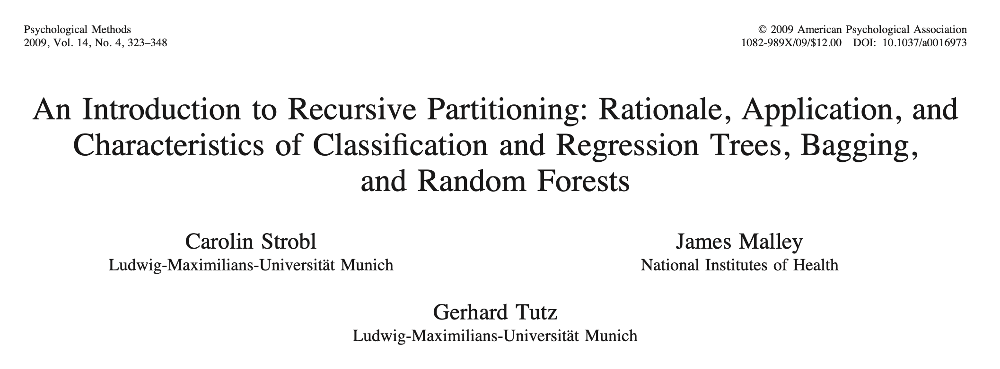
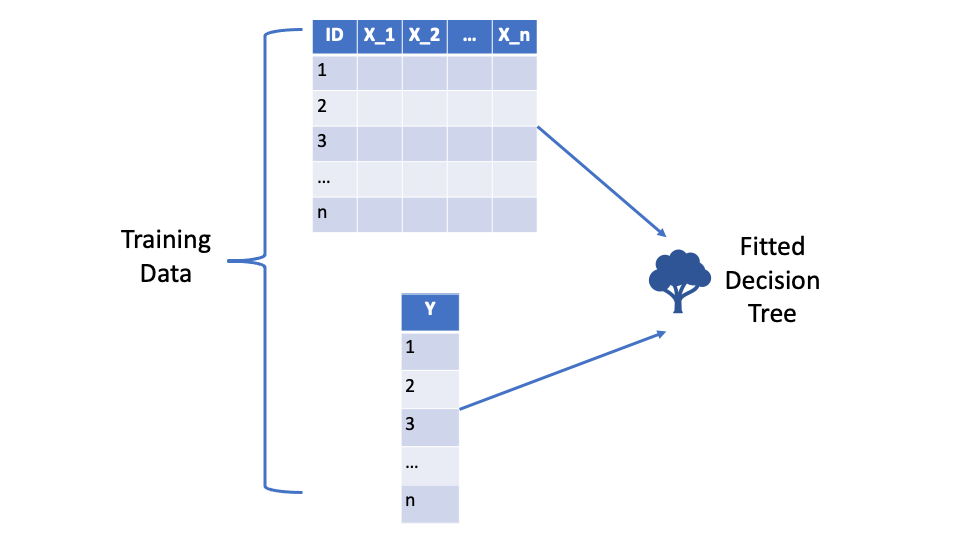
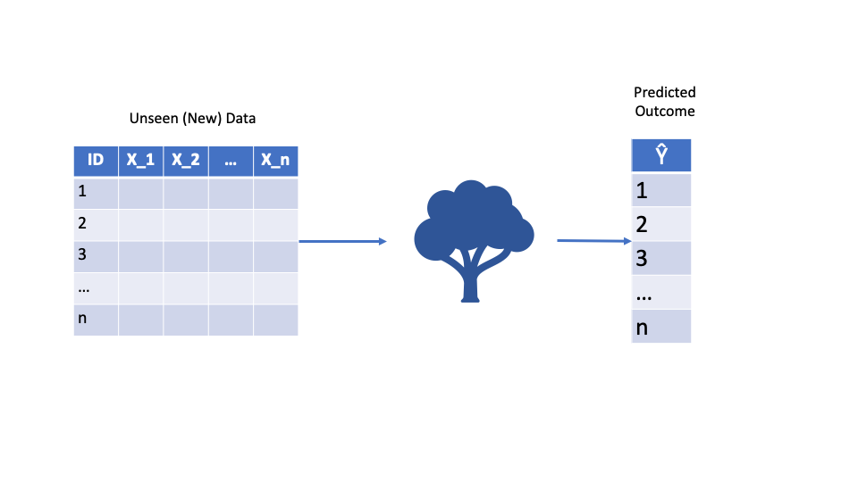
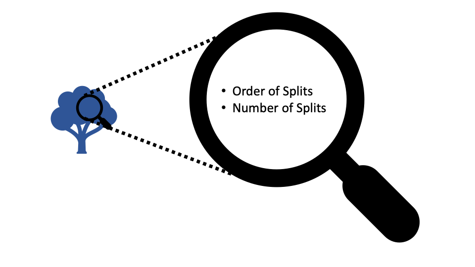
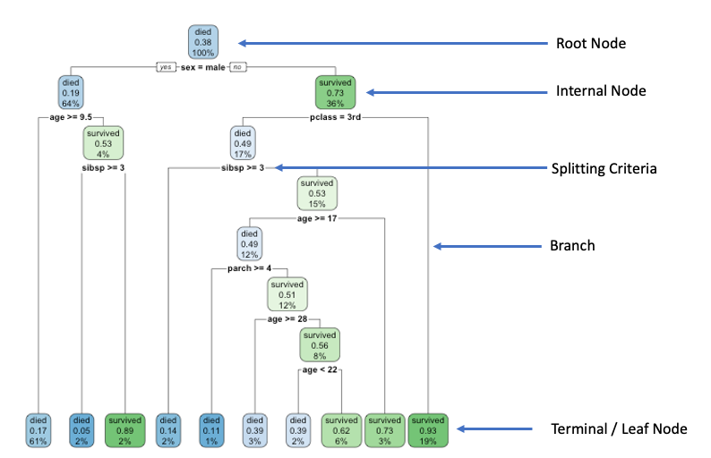
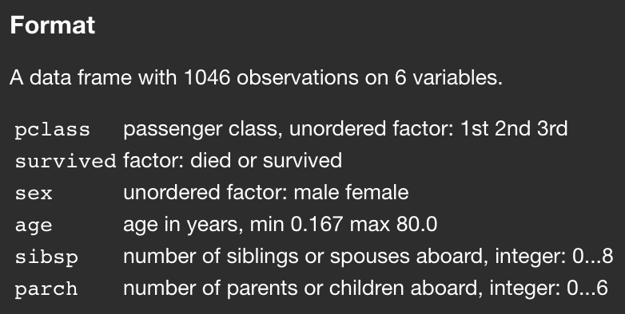

```{css echo=F}
.cl_transparent {
  position: relative;
  z-index: 1;
}

.cl_transparent::before {    
      content: "";
      background-image: url('imgs/img.jpg');
      background-size: cover;
      position: absolute;
      top: 0px;
      right: 0px;
      bottom: 0px;
      left: 0px;
      opacity: 0.5;
      z-index: -1;
}
```


```{r include=FALSE}
knitr::opts_chunk$set(message = FALSE, warning = FALSE)
set.seed(123)
```

# Day 1 Agenda

* 5 Minutes — Introduction 
* 30 minutes — Terminology and Interpretation
* 30-60 Minutes — Theory of Recursive Partitioning for Classification and Regression (with examples)
* 15 Minutes —	Coffee Break
* 60 Minutes — Lab exercise: Fitting Decision Trees in R & Model Evaluation
* 60 Minutes —	Use-Cases, Strengths, & Weaknesses of Decision Trees
* 60 Minutes — Extensions of Decision Trees; Focus on Random Forests 

---

class: left, top, cl_transparent

# Introduction

.pull-left[


<div style="border:solid; background-color:#b3e0ff
; opacity:0.7">

.left[

  **Currently**: 
  * **PhD Candidate**
    * *University of Oregon*
    * Quantitative Research Methods in Education
    * Dissertation extends model-based recursive partitioning
  
  * **Head Methodologist & Owner**
    * *Parameter Analytics, LLC.*
    * Statistics, research design, and data science consulting firm


]

]

</div>

.pull-right[

<div style="border:solid; background-color:#b3e0ff
; opacity:0.7">

.left[


**Primary Education & Work History**: 
  * Coding on-and-off since 2010 & (near) daily since 2017
  
  * Bachelor's Degree in Neuroscience
  
  * Former high school teacher
  
  * Earned my Master's Degree in Prevention Science
      * Physical and psychological well-being
      * Public Health & big data approaches 
      
  * Data Science Mentor at RStudio (now "Posit") 
]

]
</div>

---

class: center, middle

# Onward to Content

---
# A Recommended Reference

.left[

**Strobl et al. (2009)**

* offer a great review of the material in this workshop
* has been cited >2,300 times (according to Google Scholar)
* technical, but directed towards applied researchers and practitioners

] 



---
class: center

# An Essential Consideration in Applied Computational Research 

.left[
* Software packages come with default settings

* Defaults are **rarely** the most robust method, the most flexible approach, etc. 

* In Machine Learning (ML) specifically, calibrating these settings is known as "hyper parameter tuning", "hyper parameter optimization", etc.

* People spend entire careers using conceptual mathematics and computer science to master this tuning/optimization

* Many non-ML pieces of programming have defaults, too

**You always need to read the software documentation when you use something**

This lecture will build this skill in targeted places, but it **intentionally goes with defaults due to time constraints**.

]

---
# Recursive Partitioning

```{r include=FALSE}
library(tidyverse)
```

**Recursive** — Successive or Repetitive

**Partitioning** — Splitting or Dividing

___

* Binary splits are almost always used 

* This works because repeated binary splits can approximate any functional form based on observed data (i.e., Y to X relationship)

* Binary splits are intuitive — can be interpreted as "yes/no" questions

* Called "ML" because the algorithm "learns" from the data. 

* It is "supervised" the algorithm can only learn what is labeled in the data.

* Basis of decision trees, random forests, and other Machine Learning (ML) methods

---
class: center, middle

# What fields subsume recursive partitioning? 


.left[
We will **not** cover (1) Unsupervised ML, e.g., k-means clustering, or (2) Other aspects of artificial intelligence, e.g., computer vision
]
---

# Decision Trees

Decision Trees (DTs) are a straightforward application of recursive partitioning.
___

**Overarching concept (non-technical)**

*Make subgroups of the observed variables which are similar in the outcome*
___

**Overarching concept (technical)**

*Use training data to identify splitting rules which optimally divide features into non-overlapping regions, where the cases within each region are similar with respect to the outcome*

---

# Decision Trees

They have many benefits: 

* Make no assumptions about distribution of data (non-parametric)

* Can identify compounding effects from observed data, even if unspecified, e.g.,
  * non-linear effects (the variable compounding on itself)
  * interactions (the variable compounding on another)

* Easy to interpret
    * Are not an "ML Black Box", a complaint with more complex models
    * Understanding DTs makes understanding complex extensions (e.g., bagging, boosting, random forests) easier

---
class: middle, center

# What is the **bare-minimum** process to fitting a decision tree?

(i.e., saying *"it's okay"* to use defaults for everything)

---
# Fitting a Decision Tree



Need <u>"features" / predictor variables</u> & <u> **corresponding "response" / outcome** </u>

---
# Designed for Prediction 




---
# Understanding Predictions

Visual structure makes understanding predictions intuitive


---
# Some Terminology

In this software (`rpart`) "yes" to the splitting rule is on the left & "no" is right



---
## Let's look at an example: 

`?rpart.plot::ptitanic`

Outcome / response variable
* dichotomous (survived vs. died) 
* this DT is a **classification tree**


---

# Setting up

We need a package for actually fitting the data.

```{r}
# install.packages('rpart')
library(rpart)
```

This extension to `rpart` allows simple plotting, and we'll use a built-in data set from this package for our first example (data set = `ptitanic`)


```{r}
# install.packages('rpart.plot')
library(rpart.plot)
```

`rsample` is a relatively minimal, but useful package to set up the data.

```{r}
# install.packages('rsample')
library(rsample)
```

---
# Setting up

```{r}
ptitanic <- 
  ptitanic %>% 
  mutate(
    survived = relevel(survived, ref = 'died')
  )
split_data <- initial_split(ptitanic)
training_data <- training(split_data)
testing_data <- testing(split_data)


```

We will start with 2 variables to predict `survival`: `age` & `sex`

```{r include=FALSE}
descriptives <- psych::describe(rpart.plot::ptitanic$age)
```

___

### Some descriptives 

The percent of the sample which survived was ~`r round(sum(ptitanic$survived == 'survived')/nrow(ptitanic)*100)`%.

Sex (from full data):
  * `r sum(ptitanic$sex == 'male')` coded as male
  * `r sum(ptitanic$sex == 'female')` coded as female

Age (from full data):
  * Mean = `r round(descriptives$mean, 2)` years
  * Std. Dev. = `r round(descriptives$sd, 2)` years
  

---

# Fit the decision tree

Basic syntax is: `outcome_variable ~ predictors`

```{r}
two_var_DT <- 
  rpart(
    survived ~ sex + age, 
    data = training_data
    )
```

---

```{r include=FALSE}
surv_by_sex <- 
  training_data %>% 
  count(sex, survived) %>% 
  mutate(perc = 100* n / sum(n)) %>% 
  filter(survived == 'survived') %>% 
  select(sex, perc) %>% 
  split(., .$sex) %>% 
  map(
     ~paste0('~', round(pull(.x, perc)), '%')
    )
```

---


# Decision Tree Results

.left-column[

Each node shows
* predominant predicted class
* predicted probability of survival
* percent of total sample in this node

We can make it look a little different too

]

.right-column[
```{r echo=FALSE}
rpart.plot(
  two_var_DT, 
  type = 4,
  branch = 0.6,
  clip.right.labs = FALSE,
  box.palette = "Grays"
)
```
]
---

# Decision Tree Results

.pull-left[

Split order, Predicted probabilities, & node size give sense of the observed training data

* `sex` was most impacted survival

* more men than women

* Men (`r surv_by_sex$male`) survived at a lower rate than women (`r surv_by_sex$female`)

* effect of age substantial in men (younger men more likely to live)

]

.pull-right[
```{r echo=FALSE}
rpart.plot(
  two_var_DT, 
  type = 4,
  branch = 0.6,
  clip.right.labs = FALSE,
  box.palette = "Grays"
)
```
]
---

# How well does it perform? 

We can see how well the trained model performs with the withheld testing data. The model has not seen this. 

```{r include=FALSE}
tmp_tbl <- 
  testing_data %>% 
  mutate(
    predicted = predict(two_var_DT, newdata = testing_data, type = 'class'), 
    actual = survived
  ) %>% 
  count(actual, predicted) %>% 
  mutate(
   type_of_prediction = 
     case_when(
       actual == 'died' & predicted == 'died' ~ 'true negative', 
       actual == 'died' & predicted == 'survived' ~ 'false negative', 
       actual == 'survived' & predicted == 'died' ~ 'false positive',
       actual == 'survived' & predicted == 'survived' ~ 'true positive'
     ),
    proportion = 
      paste0(
        round(
          (n / sum(n))* 100), 
        '%'
        )
  ) %>% 
  arrange(desc(type_of_prediction)) %>% 
  rename(
    `type of prediction` = type_of_prediction
  ) 
```

```{r include=FALSE}
tmp_describer <- 
  tmp_tbl %>% 
  mutate(sum_n = sum(n)) %>% 
  filter(actual == predicted) %>% 
  mutate(
    correct_prop = 
      paste0('~', round(sum(n)/sum_n*100), '%'), 
  ) %>% 
  distinct(correct_prop) %>% 
  pull(correct_prop)

```

Overall, the model accurately classified `r tmp_describer`
___

To see this with more nuance, we can look at it as below: 

```{r echo=FALSE}
library(kableExtra)
kbl(tmp_tbl, caption = 'Performance of 2-variable DT')
```

---

# Feature Extraction & Interpretation
.pull-left[

```{r}
library(pdp)
## purrr has a `partial` command
## let's make sure it uses the one from `pdp`
partial <- pdp::partial

univariate_pdp_sex <- 
  partial(
    two_var_DT, 
    pred.var = 'sex',
    type = 'classification',
    which.class = 'survived'
    )
```
]
.pull-right[

```{r echo=FALSE}

## something is wrong here


univariate_pdp_sex %>% 
  ggplot(
    aes(y = sex, x = yhat, fill = sex)
  ) +
  geom_col(show.legend = F, alpha = 0.4, color = 'black') +
  theme_bw(base_size = 15) +
  labs(
    y = 'Passenger Sex', 
    x = 'Predicted Probability of Surviving', 
    title = 'Males Display a substantially lower probability of survival'
    ) +
  geom_label(
    aes(
      label = round(yhat, 2)
    )
  ) + 
  theme(plot.title.position = 'plot')
```
]

---
```{r}
univariate_pdp_age <- 
  partial(
    two_var_DT, 
    pred.var = 'age',
    type = 'classification',
    which.class = 'survived'
    )
```

```{r}
age_plt1 <- 
  univariate_pdp_age %>% 
  ggplot(
    aes(x = age, y = yhat)
  ) +
  geom_point() +
  theme_bw(base_size = 15) +
  labs(
    x = 'Passenger Age', 
    y = 'Predicted Probability of Surviving', 
    title = 'Younger individuals (>= 15) display a \nsubstantially higher probability of survival'
    ) +
  theme(plot.title.position = 'plot') +
  scale_y_continuous(
    limits = c(-0.5, 1),
    breaks = seq(-0.4, 1, 0.2)
    )
```

---

```{r}
age_plt1
```

---

```{r}
bivariate_pdp <- 
  partial(
    two_var_DT, 
    pred.var = c('age', 'sex'),
    type = 'classification',
    which.class = 'survived'
    )
```

---

```{r}
bi_pdp_plt <- 
  bivariate_pdp %>% 
  ggplot(
    aes(
      y = yhat, 
      x = age,
      color = sex
    )
  ) + 
  theme_bw() +
  geom_point() +
  theme_bw(base_size = 15) +
  labs(
    x = 'Passenger Age', 
    y = 'Predicted Probability of Surviving', 
    title = 'Women & younger men (>= 15) display a substantially\n higher probability of survival',
    fill = 'Passenger\nSex'
    ) +
  theme(
    plot.title.position = 'plot'
    ) +
  scale_y_continuous(
    limits = c(-1, 1),
    breaks = seq(-1, 1, 0.25)
    )

```

---

```{r}
bi_pdp_plt
```

---

# Improving model performance 

In many `R` packages, the `.` in a formula indicates that you want all variables (except the outcome) included

```{r}
all_var_DT <- 
  rpart(
    survived ~ ., 
    data = training_data
    )
```

---


```{r}
# I typically do NOT recommend this
three_variable_pdp <- 
  partial(
    all_var_DT, 
    pred.var = c('age', 'sex', 'pclass'),
    type = 'classification',
    which.class = 'survived'
    )
```


---

```{r}
#three_variable_plt <- 
  three_variable_pdp %>% 
  ggplot(
    aes(
      y = yhat, 
      x = age,
      shape = sex
    )
  ) + 
  theme_bw() +
  geom_point(
    size = 4, 
    alpha = 0.4
  ) +
  theme_bw(base_size = 15) +
  labs(
    x = 'Passenger Age', 
    y = 'Predicted Probability of Surviving', 
    title = 'Women & younger men (>= 15) display a substantially\n higher probability of survival',
    fill = 'Passenger\nSex'
    ) +
  theme(
    plot.title.position = 'plot'
    ) +
  facet_wrap(vars(pclass), ncol = 1)
```

---

```{r}
three_variable_plt
```

---

```{r}
glm_comparison <-
  glm(
    data = training_data,
    formula = survived ~ ., 
    family = binomial(link = "logit")
  )
```

```{r}
summary(glm_comparison)
```

---

Let's contrast this to a logistic regression

```{r}
glm_pdp <- 
  partial(
    glm_comparison, 
    pred.var = c('sex', 'age', 'pclass'),
    type = 'classification'
    #which.class = 'survived'
    ) %>% 
  mutate(
    model = 'glm'
  )
```

```{r}
three_variable_pdp %>% 
  mutate(
    model = 'DT'
  ) %>% 
  bind_rows(glm_pdp) %>% 
  ggplot(
    aes(
      y = yhat, 
      x = age,
      shape = sex,
      color = model
    )
  ) + 
  theme_bw() +
  geom_point(
    size = 4, 
    alpha = 0.4
  ) +
  theme_bw(base_size = 15) +
  labs(
    x = 'Passenger Age', 
    y = 'Predicted Probability of Surviving', 
    title = 'Women & younger men (>= 15) display a substantially\n higher probability of survival',
    fill = 'Passenger\nSex'
    ) +
  theme(
    plot.title.position = 'plot'
    ) +
  facet_wrap(vars(pclass), ncol = 1) 
```

---

The models predict survival *differently*, but we can't tell what is better from this. 

Let's compare predictions on unseen data

The code to make this plot is long, so i'm actually not sharing it all. But here is how I made predictions

```{r}
tmp_tbl <- 
  testing_data %>% 
  mutate(
    # in this context, the . means "what's carried from the pipe"
    predicted_DT = 
      predict(two_var_DT, newdata = testing_data)[,'survived'], 
    predicted_glm = 
      predict(
        glm_comparison,
        newdata = testing_data, 
        type = 'response'
        ), 
    actual = survived
  )
```

---

```{r}
tmp_plt_df <- 
  tmp_tbl %>%
  pivot_longer(
    cols = c(predicted_DT, predicted_glm), 
    names_to = 'model', 
    values_to = 'predicted', 
    names_prefix = 'predicted_', 
  ) %>% 
  mutate(
    predicted_class = 
      if_else(round(predicted) == 1, 'survived', 'died'),
    accuracy = 
      if_else(predicted_class == survived, 'correct', 'incorrect'),
    stringent_accuracy = 
      if_else(is.na(accuracy), 'incorrect', accuracy)
        )

nas_in_glm <- 
  tmp_plt_df %>% 
  group_by(model) %>% 
  count(accuracy) %>% 
  mutate(
    proportion = 
      paste0(
        round(
          (n / sum(n))* 100), 
        '%'
        )
    ) %>% 
  filter(is.na(accuracy)) %>% 
  pull(proportion)
  
plt_df <- 
  tmp_plt_df %>% 
  group_by(model) %>% 
  count(stringent_accuracy) %>% 
  mutate(
    proportion = 
      paste0(
        round(
          (n / sum(n))* 100), 
        '%'
        )
    )
 
```

```{r include=FALSE}
pos_tmp <-
  position_dodge(width = 1)

comp_acc_plt <- 
  plt_df %>% 
  ggplot(
    aes(
      x = stringent_accuracy,
      y = n, 
      fill = model
    )
  ) + 
  geom_col(
    position = pos_tmp,
    alpha = 0.6, 
    color = 'black'
  ) +
  geom_label(
    aes(label = proportion), 
    position = pos_tmp
  ) +
  theme_bw() + 
  labs(
    x = 'Accuracy', 
    y = 'Count',
    title = 
       paste0(
         'This decision tree outperforms the glm\nHowever, ~',
         nas_in_glm, 
        ' of the "incorrect" glm predictions were technically missing'
        ),
         
  ) + 
  theme(
    plot.title.position = 'plot', 
    plot.caption.position = 'plot'
  )
```

```{r}
comp_acc_plt
```

We can look at this in more detail

```{r eval=FALSE, include=FALSE}
#tmp_tbl <- 
  tmp_plt_df %>%
  mutate(
   type_of_prediction =
     case_when(
       actual == 'died' & predicted_class == 'died' ~ 'true negative',
       actual == 'died' & predicted_class == 'survived' ~ 'false negative',
       actual == 'survived' & predicted_class == 'died' ~ 'false positive',
       actual == 'survived' & predicted_class == 'survived' ~ 'true positive'
     )
  ) 
```

---

Let's look at predicted probabilities for a random sampling of points

```{r}
set.seed(2) 

tmp_tbl %>%
  mutate(id = 1:n()) %>% 
  drop_na() %>% 
  sample_n(4) %>% 
  pivot_longer(
    cols = c(predicted_DT, predicted_glm), 
    names_to = 'model', 
    values_to = 'predicted', 
    names_prefix = 'predicted_', 
  ) %>% 
  mutate(
    predicted_class = 
      if_else(round(predicted) == 1, 'survived', 'died'),
    actual = paste0('Reality: ', actual)
  ) %>% 
  ggplot(
    aes(
      x = predicted, 
      y = predicted_class, 
      color = model,
      label = 
        paste0(
          'ID ', id, ':\n',
          'prob = ', round(predicted, 2)
        )
      )
    ) +
  geom_point() +
  geom_label_repel(
    aes(fill = model),
    color = 'black'
  ) +
  scale_x_continuous(
    limits = c(-0.25, 1.25), 
    labels = seq(0, 1, 0.25)
  ) +
  theme_bw() +
  facet_wrap(vars(actual), nrow = 1) +
  labs(
    y = 'Prediction'
  )
```

---

# Benefits of decision trees

* work for many outcome types
    * dichotomous = "classification" tree
    * continuous = "regression" tree
    
    
---


```{r}

```

